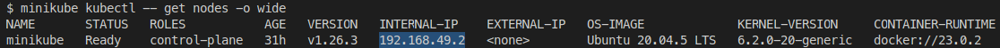

<p align="center">
  <a href="http://nestjs.com/" target="blank"></a>
  <a href="https://fr.openfoodfacts.org/" target="blank"></a>
</p>

# Description

A NestJS API for obtaining barcode information via the OpenFoodFact API.

# Documentation

The documentation is automatically generated by swagger and is accessible at the url http://localhost:3000/api

# Running the app

## run in courrent system (with a docker image from postgres)

```bash
# in a production environment you need to modify these variables
$ cp sample.env .env

# export of the .env file in the environment of the machine
$ export $(grep -v '^#' .env | xargs)

# run postgres container
$ docker run --detach \
           --name postgres_local \
           --env POSTGRES_USER \
           --env POSTGRES_PASSWORD \
           --env POSTGRES_DB \
           --publish 5432:5432 \
           --volume /custom/data:/var/lib/postgresql/data \
           postgres:15

# run app in production mode
$ npm run start:prod

# test crud-nestjs
$ curl http://localhost:3000
```

## run in docker image

```bash
# in a production environment you need to modify these variables
$ cp sample.env .env

# export of the .env file in the environment of the machine
$ export $(grep -v '^#' .env | xargs)

# optional: if the image is not built locally it will automatically be downloaded from docker hub
$ docker build --tag anclarma/crud-nestjs .

# run postgres container
$ docker run --detach \
           --name postgres \
           --env POSTGRES_USER \
           --env POSTGRES_PASSWORD \
           --env POSTGRES_DB \
           --expose 5432 \
           --net=bridge \
           --volume /custom/data:/var/lib/postgresql/data \
           postgres:15

# export postgres host ip for crud-nestjs container
$ export POSTGRES_HOST=$(docker network inspect bridge | grep -A 4 "\"Name\": \"postgres\"" | grep "IPv4Address" | cut -d'"' -f4 | cut -d'/' -f1)

# run crud-nestjs container
$ docker run --detach \
           --name crud-nestjs \
           --env POSTGRES_HOST \
           --env POSTGRES_PORT \
           --env POSTGRES_USER \
           --env POSTGRES_PASSWORD \
           --env POSTGRES_DB \
           --env JWT_SECRET \
           --publish 3000:3000 \
           --net=bridge \
           anclarma/crud-nestjs

# test crud-nestjs
$ curl http://localhost:3000
```

## run in docker compose

```bash
# in a production environment you need to modify these variables
$ cp sample.env .env

# run crud-nestjs and postgres in docker compose
$ docker compose up -d

# test crud-nestjs
$ curl http://localhost:3000
```

## run in kubernetes (minikube)

```bash
$ minikube start
$ minikube addons enable ingress
$ minikube kubectl -- apply -f manifest/postgres-deployment.yaml
$ minikube kubectl -- apply -f manifest/crud-nestjs-deployment.yaml
$ minikube kubectl -- apply -f manifest/ingress.yaml

# get kubernetes cluster ip address
$ minikube kubectl -- get nodes -o wide
```



```bash
# test crud-nestjs (replace the ip by the result of the previous command)
$ curl http://192.168.49.2
```
